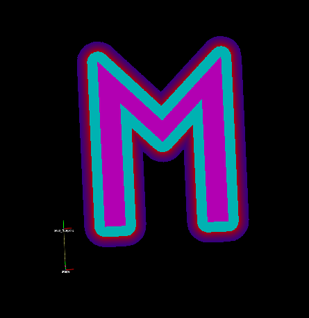

# virtual_costmap_layer

## Overview
This package includes a ROS1 plugin to add a virtual layer of geometric elements in the 2D costmap. 
The user can define several forms based on `well-known text representation of geometry` ([link](https://en.wikipedia.org/wiki/Well-known_text_representation_of_geometry) for more details) in the map frame.   

## Generated message and service

This project generate some new custom messages and services:

### Form message 
This is the main message used in the communication with the package, it has 4 possible type: 
   
   * LINESTRING
   * RING
   * POLYGON
   * CIRCLE :warning: __NOT SUPPORTED YET__ :warning:

These form are represented with wkt data. Here is some example:

```
# A linestring
- LINESTRING (3 1, 1 3, 4 4)
   
# A ring (M letter filled)
- POLYGON ((), (1 1, 1 5, 2.5 3.5, 4 5, 4 1, 3.5 1, 3.5 4, 2.5 3, 1.5 4, 1.5 1))

# A polygon (M letter empty)
- POLYGON ((1 1, 1 5, 2.5 3.5, 4 5, 4 1, 3.5 1, 3.5 4, 2.5 3, 1.5 4, 1.5 1))

# A polygon (Random polygon with one inner)
- POLYGON ((3.5 1, 4.5 4.5, -1.5 4, -1 -2, 3.5 -1), (2 3, 1.5 2.5, 1 1, 1 3))

```

Please note that `rings` are specific case of `polygons` in wkt data. _A ploygon contains an outer ring and multiple inner rings_. In our package, an element in the virtual layer with a ring format is filled. If you need to define a hallow ring form, you may use a polygon with no inner (see the empty M letter examples below)    

#### Line string and polygon with inner
<div align=right>
<table>
  <tr>
    <td></a></td>
    <td></a></td>
  </tr>
</table>
</div>

#### Polygon with only outer and ring (M letter)
<div align=right>
<table>
    <tr>
    <td></a></td>
    <td></a></td>
  </tr>
</table>
</div>

Each form has a unique `uuid` and a `lifetime` duration in the layer. For more details, you can look at the [message definition](./msg/Form.msg)

### Custom services

4 services are added to this project: 

* [AddElement](./srv/AddElement.srv)
* [GetElement](./srv/GetElement.srv)
* [GetElements](./srv/GetElements.srv)
* [RemoveElement](./srv/RemoveElement.srv)

Each one of these services will be described in the next section 

## ROS1 Node API
### Services

`~<name>/add (virtual_costmap_layer/AddElement)`
Add a geometric form to the virtual costmap layer. It will return an uuid related to the form.

`~<name>/remove (virtual_costmap_layer/RemoveElement)`
Remove element form the layer with the uuid.

`~<name>/get (virtual_costmap_layer/GetElement)`
Get element from costmap layer by uuid.

`~<name>/status (virtual_costmap_layer/GetElements)`
Get all elements from costmap layer.

`~<name>/clear (std_srvs/Trigger)`
Delete all elements from costmap layer.

### Parameters

This layer has some specific configuration 

`~<name>/enabled (boolean)` Parameter to enable the virtual layer on the costmap.

`~<name>/tessellation/enabled (boolean)` Enable tessallator to fill geometric forms (rings). This process is added to support none convex forms. (See examples in the next section)  

`~<name>/forms (string array)` List of elements that will be added to the layer at launch time. These forms are defined using wkt data. 

## Tutorial

### Building project
To build the package with your current catkin workspace, you can use one of these two commands

```bash
  catkin_make
```
or 

```bash
  catkin_make_isolated --force-cmake 
```

### Run sample

A sample in which you can find a costmap layer with a static layer (from a static map) and a virtual layer is added to this package. 
To run the sample, you can run this command after sourcing the package.

```bash
  roslaunch virtual_costmap_layer sample.launch
```


